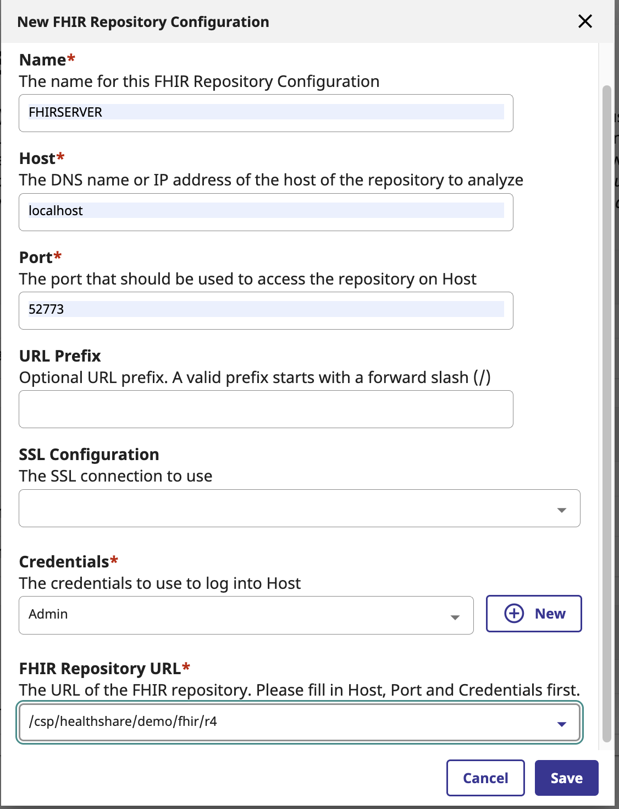
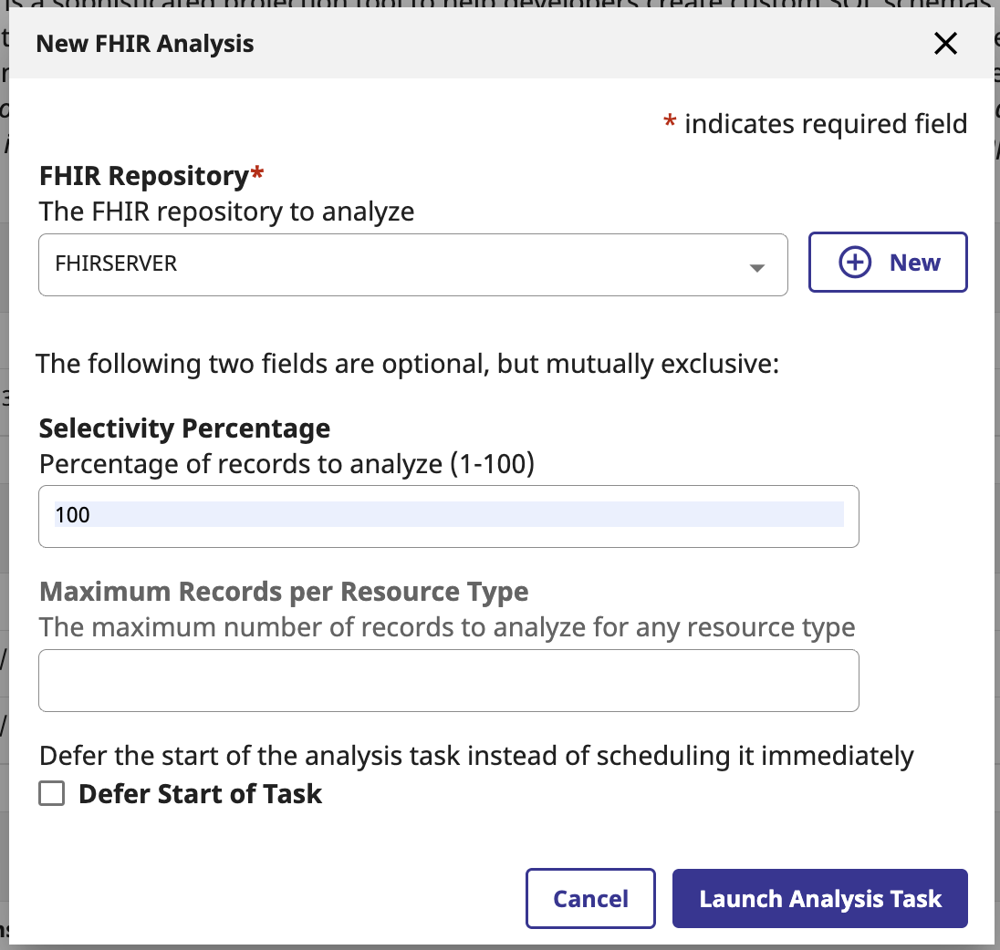
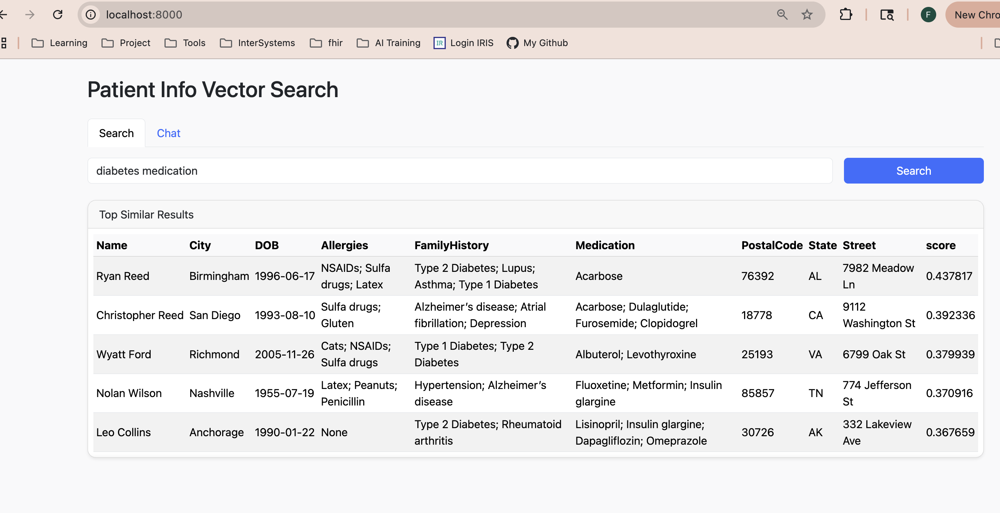
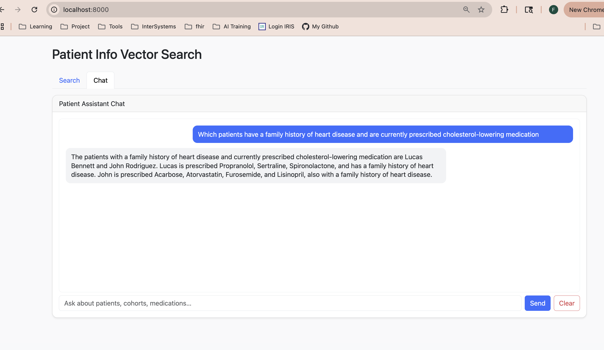

# IRIS FHIR SQL Builder + Vector Search
This repository demonstrates a Proof of Concept (PoC) application leveraging **InterSystems IRIS For Health** to perform semantic search on FHIR data. It combines the capabilities of the **FHIR SQL Builder** for relational data projection and **Vector Search** for meaning-based retrieval.

## Overview
This project supports semantic search on FHIR data using InterSystems IRIS. By combining the **FHIR SQL Builder** with **Vector Search**, it allows users to query clinical records in natural language, bridging the gap between complex FHIR structures and human-readable search.

In this project, we work with **FHIR Questionnaire** and **QuestionnaireResponse** data from 100 patients, containing names, family history, allergies, and other information. While this data is standardized, its nested structure makes it challenging to query directly. By flattening the data into relational tables and generating semantic embeddings, we implement intuitive, meaning-based search—allowing users to find relevant patient information without needing to understand FHIR’s complexity.

## Prerequisites
Before running this project, make sure you have the following:
1. **OpenAI API Key**

    In the App folder,edit the existing `.env` file and replace the placeholder with your own key:
    ```bash
    OPENAI_API_KEY= your_api_key_here
    ```
2.  **Docker**

    Used to run InterSystems IRIS and supporting services in a containerized environment.
    Install Docker from: https://www.docker.com/get-started


### Installation
1.  **Clone the repository**
    ```bash
    git clone https://github.com/fanji-isc/IRIS-FHIR-sqlbuilder-vectorsearch.git
    cd IRIS-FHIR-sqlbuilder-vectorsearch
    ```
    
2.  **Build and Start IRIS For Health**
    ```bash
    docker-compose up -d --build iris4health
    ``` 
3.  **Configure FHIR SQL Builder**
    * **IRIS Portal**: `http://localhost:8080/csp/sys/UtilHome.csp`
        * **Username**: _SYSTEM
        * **Password**: ISCDEMO

    In IRIS Portal, navigate to Health--> Click on the DEMO Namespace--> FHIR Server Management-->FHIR SQL Builder(left side menu) , 
    fill out each section with below information.

    * **Analysis**
        * Click , then under FHIR Repository,click ,
        fill out the form with below information
        * **Name:FHIRSERVER**
        * **Host:localhost**
        * **Port:52773**
        * **Credentials: **
            * **Name:Admin**
            * **Username:_SYSTEM**
            * **Password:ISCDEMO**
        * **FHIR Repository URL: /csp/healthshare/demo/fhir/r4**
        * Click **Save**

        


        In the New FHIR Analysis
        * **FHIR Repository: FHIRSERVER**
        * **Selectivity Percentage:100**
    
        

        Click “Launch Analysis Task” 

        This will return you to the InterSystems FHIR SQL Builder page 

    * **Transformation Specifications**
        * Click **Import** and select the `transform1.json` file located in the `fhirdata/` folder of this repository.
        * Keep the default Name: transform1 
        * Under Analysis, select FHIRSERVER 
        * Click ,
    * **Projections**
        * Click , fill out the form with below information
        * **FHIR Repository:FHIRSERVER**
        * **Transformation Specification:transform1**
        * **Package Name:sql1**
        * **Click 

        

4.  **Accessing FHIR Data via SQL**
    Open a new tab with the IRIS Management Portal: http://localhost:8080/csp/sys/UtilHome.csp      

    Click System Explorer ->> SQL 

    In the Management Portal SQL interface, select DEMO as Namespace. Under Tables, you will see the SQL table generated from your QuestionnaireResponse data, ready for querying and analysis.
    ```sql
    SELECT * FROM sql1.QuestionnaireResponse
    ```
    

5.  **Application Setup & Vectorization**

    Now that the data is projected to SQL, start the Python application to generate embeddings and perform searches.

    After running 

    ```bash
    docker-compose up -d --build flask
    ``` 

    you should be able to access your application's user interface at:

    `http://localhost:8000`

    (this build takes several minutes to complete) 

6. **Usage & Demo**

    
    * A search for “diabetes medication” retrieves responses mentioning drugs like metformin, insulin glargine, or acarbose—even if the exact phrase isn’t present.
    
    

    * In the Chat Tab, when a user asks, “Which patients have a family history of heart disease and take cholesterol-lowering medication?”, the system semantically links related data—connecting cardiac conditions with drugs like propranolol, spironolactone, or atorvastatin—and returns a concise summary of at-risk patients. 

       This shows the benefit of semantic search: users don’t need to know exact database fields, FHIR structure, or medication names. The system interprets clinical meaning, retrieves the most relevant information, and summarizes it in a human-readable form.

    * Users can explore additional prompts such as:

        “I will see Luna Walker today. Please summarize this patient’s medical history.”

        "Which patients may require follow-up based on their questionnaire responses?"
        
    
